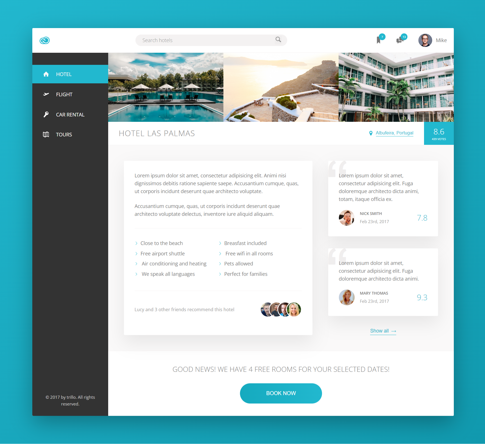

# Trello



## About


This project is a beautifully designed Trello-inspired UI page, showcasing advanced CSS techniques. It features sophisticated animations, responsive design, flexbox layouts, Sass for styling, SVG integration, and precise element control through absolute positioning.

**Special Thanks:** A heartfelt thanks to _Jonas Schmedtmann_ for his incredible guidance and expertise. His teachings have been instrumental in bringing this project to life.

<a href="https://trello2103.netlify.app/"></a>

## Tech & Tools


## Getting Started

**Step 1** : Must have VS-Code Extentions

```
1. Prettier-Code formatter
2. Live Server
```

**Step 2** : Install `npm packages`

```
npm install
```

**Step 3** : build `css` from `sass`

```
npm run build:css
```

## Contact Me

[](https://github.com/arpitjana21)
[](https://www.linkedin.com/in/arpitjana2103/)

## LISENSE

[](https://opensource.org/license/mit/)

Copyright (c) 2024 Arpit Jana
